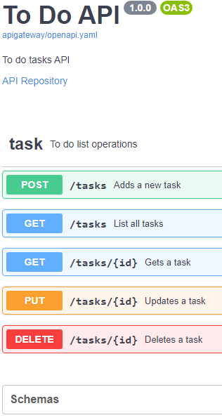
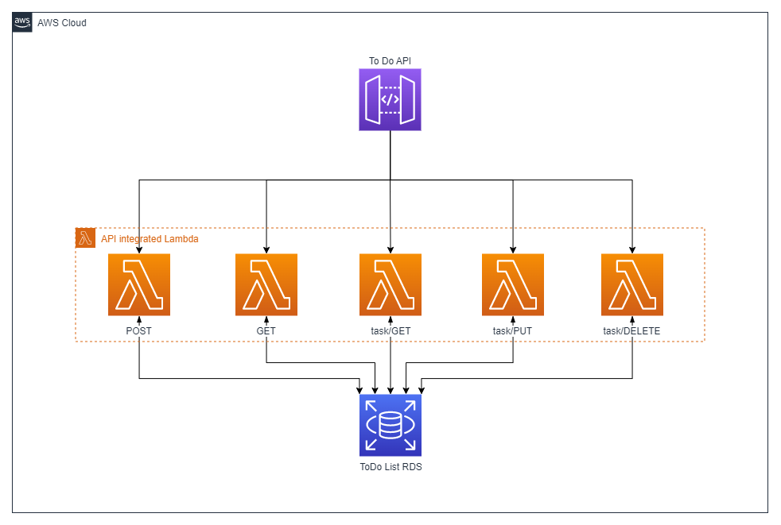

<div align="center">
  
  
  
  
</div>

<p align="center">
  <a href="https://icrosa.github.io/API_Gateway_with_openapi_and_terraform/">
    
  </a>
</p>

- [Click to check the API on Swagger UI](https://icrosa.github.io/API_Gateway_with_openapi_and_terraform/)

- This us an project that uses terraform to place a ToDo list that is managed by an AWS API Gateway integrated with lambdas to make CRUD operations. 



# Take a look :computer:
Here are explanations, details and curiosities about each module of this project

 - [Root](#mainroot-module)
 - [Api Gateway](apigateway/) :star:
 - [IAM](iam/)
 - [Lambda](lambda/)
 - [RDS](rds/)

---

## Main/Root module :purple_circle:
Here we find the [provider](#provider), the [main variables](#variables) , the [outputs](#output) and the [main](#main) file.

### [Main](main.tf)
 - The child modules are declared here, by commenting a block its excluded in ``` terraform apply ``` (Be careful about dependencies).

 - Every variable passed with ``` module. ``` means a dependency with this module

### [Provider](provider.tf)
 - This code uses the provider hashicorp/aws, version 4.64.0. 

 - To use a S3 as backed uncomment the ``` backend "s3" ``` block and replace the "bucket" value with your bucket name.

 - aws credentials are passed by variables, these can be defined by a .tfvars file or by locally exporting them

### [Variables](variables.tf)
 - This file creates the variables that are used to connect to aws and to the Postgres RDS. 

 - The RDS vars have a default values that will go on if you do not define yours.

 - Every variable her can be defined by a .tfvars file, here is an exemple of a .tfvars file:
 ```hcl
db_port   = 5432
db_user   = "postgres"
db_pass   = "12345678"
db_dbname = "postgres"

access_key = "yourawsacceskey"
secret_key = "yoursecretawskey"
 ```
 - You can also define using environment variables exporting them with something like:
 ```cmd
 export TF_VAR_db_port=5432
 export TF_VAR_db_user="postgres"
 export TF_VAR_db_pass="12345678"
 export TF_VAR_db_dbname="postgres"
 export TF_VAR_access_key="yourawsacceskey"
 export TF_VAR_secret_key="yoursecretawskey"
 ```

### [Output](output.tf)
 - When you run ``` terraform apply ``` successfully, the API endpoint will be shown
