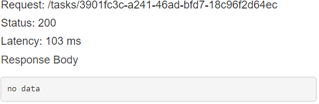

## API gateway
This clean code creates an API on AWS API gateway from a templated openapi definition.

Using the resources in [api_with_openapi.tf](api_with_openapi.tf) file terraform renders the tamplate file, creates the api from the rendered, deploys the api on AWS with the terraform workspace as the stage name and integrates with the assigned lambdas creating the permissions/triggers.

---

As an API that realises CRUD operations in a ToDo list stored in a Postgres RDS database it can serve as a good base to execute this operations on a larger database or on a OLTP, different schemas or nescessary restrictions can be configured in the [lambdas code](../lambda/upload-lambda/tasks_orm.py) as the lambda that creates the tables is within this code.

<table>

  <caption>

    API Requests and Responses

  </caption>

<thead>
  <tr>
    <th>Relative Path</th>
    <th>Http Method</th>
    <th>Request Body Format</th>
    <th>Request Body</th>
    <th>Response</th>
  </tr>
</thead>
<tbody>
  <tr>
    <td rowspan="3">/tasks</td>
    <td rowspan="2">POST</td>
    <td rowspan="2">
        { 
        &ensp;"task": "<b style='color:gray'><em>Task Name</em></b>", 
        &ensp;"description": "<b style='color:gray'><em>Task Description</em></b>" 
        &ensp;"done": <b style='color:gray'><em>Bool</em></b>, 
        }
    </td>
    <td>
        { 
        &ensp;"task": "Buy groceries"<b style='color:red'><em>.</em></b> 
        &ensp;"description" <b style='color:red'><em>=</em></b> "Buy milk and eggs" 
        }
    </td>
    <td>
400

    "Error while getting 'body' params, make sure you have passed the json formated params"
    </td>
  </tr>
  <tr>
    <td>
        { 
        &ensp;"task": "Buy groceries", 
        &ensp;"description": "Buy milk and eggs", 
        &ensp;"done": false 
        }
    </td>
    <td>
201

    { 
        &ensp;"id": "<b style='color:gray'><em>generated uuid</em></b>", 
        &ensp;"task": "Buy groceries", 
        &ensp;"description": "Buy milk and eggs", 
        &ensp;"done": false, 
        &ensp;"made_on": "<b style='color:gray'><em>current datetime in ISO format</em></b>", 
        &ensp;"done_on": null 
        }
    </td>
  </tr>
  <tr>
    <td>GET</td>
    <td>N/A</td>
    <td>N/A</td>
    <td>
200

    {[<em style='color:gray'>Obj1, Obj2, Obj3, ...</em>]} <b style='color:gray'><em>List of all the objects in the table</em></b>
    </td>
  </tr>
  <tr>
    <td rowspan="5">/tasks/{id}</td>
    <td rowspan="3">PUT</td>
    <td rowspan="3">
        { 
        &ensp;"task": "<b style='color:gray'><em>Task Name</em></b>", 
        &ensp;"description": "<b style='color:gray'><em>Task Description</em></b>" 
        &ensp;"done": <b style='color:gray'><em>Bool</em></b>, 
        }
    </td>
    <td>
        { 
        &ensp;"task": "Buy groceries"<b style='color:red'><em>.</em></b> 
        &ensp;"description" <b style='color:red'><em>=</em></b> "Buy milk and eggs" 
        }
    </td>
    <td>
400

    "Error while getting 'body' params, make sure you have passed the json formated params"
    </td>
  </tr>
  <tr>
    <td>
        { 
        &ensp;"task": "Buy groceries", 
        &ensp;"description": "Buy milk and eggs", 
        &ensp;"done": <em style='color:lightgreen'>true</em> 
        }
    </td>
    <td>
200

    { 
    &ensp;"id": "<b style='color:gray'><em>Task id</em></b>", 
    &ensp;"task": "Buy groceries", 
    &ensp;"description": "Buy milk and eggs", 
    &ensp;"done": <em style='color:lightgreen'>true</em>, 
    &ensp;"made_on": "<b style='color:gray'><em>Datetime in ISO format</em></b>", 
    &ensp;"done_on": "<b style='color:gray'><em>Current datetime in ISO format</em></b>" 
    }
    </td>
  </tr>
  <tr>
    <td>
        { 
        &ensp;"task": "<em style='color:lightgreen'>Change task name</em>", 
        &ensp;"description": "<em style='color:lightgreen'>Change task description</em>" 
        }
    </td>
    <td>
200

    { 
    &ensp;"id": "<b style='color:gray'><em>Task id</em></b>", 
    &ensp;"task": "<em style='color:lightgreen'>Change task name</em>", 
    &ensp;"description": "<em style='color:lightgreen'>Change task description</em>", 
    &ensp;"done": true, 
    &ensp;"made_on": "<b style='color:gray'><em>Datetime in ISO format</em></b>", 
    &ensp;"done_on": "<b style='color:gray'><em>Datetime in ISO format</em></b>" 
    }
    </td>
  </tr>
  <tr>
    <td>GET</td>
    <td>N/A</td>
    <td>N/A</td>
    <td>
200

        { 
        &ensp;"id": "<b style='color:gray'><em>generated uuid</em></b>", 
        &ensp;"task": "<b style='color:gray'><em>Task Name</em></b>", 
        &ensp;"description": "<b style='color:gray'><em>Task Description</em></b>", 
        &ensp;"done": <b style='color:gray'><em>Bool</em></b>, 
        &ensp;"made_on": "<b style='color:gray'><em>datetime in ISO format</em></b>", 
        &ensp;"done_on": <b style='color:gray'><em>datetime in ISO format</em></b> 
        }
    </td>
  </tr>
  <tr>
    <td>DELETE</td>
    <td>N/A</td>
    <td>N/A</td>
    <td>
200
</td>
  </tr>
  <tr>
    <td>/tasks/{Bad id}</td>
    <td>ANY</td>
    <td>Any valid</td>
    <td>Any valid</td>
    <td>
404

    "id not found"</td>
  </tr>
</tbody>
</table>

---

## Here are some prints of the API working (CRUD):
###### The latency is larger since its a SP Brasil to N. Virginia US call and an edge optimization do not seem necessary  to a ToDo list

### POST (Create)
#### Input:

#### Output:

### GET (Read)
#### Output:

### PUT (Update)
#### Input:

#### Output:

### DELETE
#### Output:
